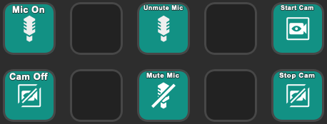
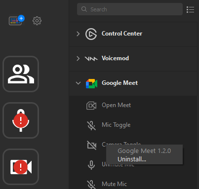

# Stream Deck Google Meet Plugin



This is a plugin that allows the [Elgato Stream Deck](https://www.elgato.com/en/gaming/stream-deck) to control your camera and microphone in a Google Meet call. It provides toggle buttons that show whether your camera and mic are on or off, and they update whenever you press a Stream Deck button or mute/unmute directly in Meet. It also provides some other buttons to control various elements of the Meet web UI.

This plugin works in conjuction with our Google Chrome / Mozilla Firefox browser extension, which is required for this plugin to function.

Developed and tested primarily on macOS 15.0, Python 3.13.0, Chrome 130, and Stream Deck app v6.6. It should work on Windows or in Firefox as well.

## Installing

1. If you're running on an Apple Silicon Mac (e.g. an M1 chip), you must have Apple's [Rosetta 2](https://support.apple.com/en-us/HT211861) installed. If you don't (or if you're not sure), open Terminal and run this command:

```
softwareupdate --install-rosetta --agree-to-license
```

2. From the [Releases page](https://github.com/ChrisRegado/streamdeck-googlemeet/releases), download the `com.chrisregado.googlemeet.streamDeckPlugin` package and open it. The Stream Deck desktop software will prompt you to install the plugin.
3. The browser extension is not in the web store, so we'll install it manually:

    **For Google Chrome:**
    1. From the [Releases page](https://github.com/ChrisRegado/streamdeck-googlemeet/releases), download the `chrome-extension` zip file and extract it somewhere you can keep it. (If you move the folder after installing, Chrome will uninstall the extension from your browser and you'll have to reinstall it.)
    2. From Chrome's extension settings page (`chrome://extensions/`), turn on "Developer mode" using the toggle at the top-right corner of the page.
    3. Click the "Load unpacked" button at the top-left corner, and select the folder you extracted the zip to earlier.
    4. You can turn Developer mode back off now if you want.

    **For Mozilla Firefox:**
    1. From the [Releases page](https://github.com/ChrisRegado/streamdeck-googlemeet/releases), download the Firefox extension `.xpi` file.
    2. From Firefox's extension settings page (`about:addons`), click the Settings cogwheel at the top-right of the page, click "Install Add-on From File...", and select the `.xpi` file that you just downloaded.
    3. Click "Add" on the Firefox popup to allow the extension to install.

4. If you use an ad blocker (such as uBlock Origin with the EasyPrivacy filter list), you may have to add meet.google.com as a trusted site in your blocker's settings to allow the browser Extension to work. (Some filters block websockets to 127.0.0.1, which this extension needs to communicate with the Stream Deck.)
5. Add some buttons to your Stream Deck, and start a Google Meet call to try them out!

It's safe to delete the `com.chrisregado.googlemeet.streamDeckPlugin` file once it's installed. However, on Windows, you may need to quit the Stream Deck desktop software (by right clicking its icon in the Windows task tray and clicking Quit) and re-launch it to avoid "action can't be completed because the file is open" errors.

## Updating

To update the Stream Deck plugin, download and open the new plugin package just like when you initially installed it. If you experience any glitches after updating (such as on/off icons not changing on the toggle buttons), please try deleting your Meet buttons and re-adding them to your Stream Deck in the Stream Deck desktop app.

To update the browser extension, [uninstall](#uninstalling) your existing version from your browser's Extension Settings page, and then follow the installation instructions again to install the new version.

## Uninstalling

In Chrome, go to your extensions settings page (`chrome://extensions/`) and click the Remove button for "Stream Deck Google Meet Actions".

In Firefox, go to your extensions settings page (`about:addons`), click the 3 dots button next to "Stream Deck Google Meet Actions", and click Remove.

In the Stream Deck desktop app, right click on one of the Google Meet actions in the list on the right-hand side of the window, and click the "Uninstall..." button.



## Troubleshooting

* If Chrome won't let you enable the extension because it was not installed from the web store, you may need to allowlist the extension. On Windows, you can do this by editing the registry. Under both `HKEY_LOCAL_MACHINE\SOFTWARE\Policies\Google\Chrome\ExtensionInstallWhitelist` and `HKEY_LOCAL_MACHINE\SOFTWARE\Policies\Google\Chrome\ExtensionInstallAllowlist` add a string value, with the name "1" (or a greater number if "1" already exists). The value should be the extension ID, which you can get from [chrome://extensions/](chrome://extensions/) with Developer Mode on. If this does not work or you're on another operating system, you may find [this post](https://superuser.com/questions/767286/re-enable-extensions-not-coming-from-chrome-web-store-on-chrome-v35-with-enhan#) helpful.

## How It Works

The Stream Deck plugin launches a localhost-only Websocket server on port 2394, which our browser extension connects to. The plugin and browser extension send messages back and forth over that websocket to notify the Stream Deck when Meet changes its device on/off status, and simulates Meet mute button clicks in your browser when you press a key on your Stream Deck.

The Stream Deck plugin code is in the `streamdeck-plugin` directory. The browser extension code is in the `browser-extension` directory. The `com.chrisregado.googlemeet.sdPlugin` directory contains our Stream Deck assets and it becomes our Stream Deck plugin distributable once we bundle our code with the Elgato DistributionTool.

## Developing the Stream Deck Plugin

### First Time Setup

The plugin is written in Python. Create a venv to hold your package's dependencies, and install those dependencies:

MacOS:

```
cd streamdeck-plugin
python3 -m venv venv/
source venv/bin/activate
pip install -r requirements.txt
```

Windows:

```
cd streamdeck-plugin
python3 -m venv venv/
venv\Scripts\activate.bat
pip install -r requirements.txt
```

Remember that virtualenvs are not portable. If you move this folder at all, you'll have to delete the venv and re-create it.

### Running Unit Tests

MacOS:

```
cd streamdeck-plugin
source venv/bin/activate
python -m unittest
```

Windows:

```
cd streamdeck-plugin
venv\Scripts\activate.bat
python -m unittest
```

### Bundling

We use `pyinstaller` to bundle our code, dependencies, and a Python runtime environment into an executable. We put that executable into the `com.chrisregado.googlemeet.sdPlugin` folder, which in turn gets zipped up by the [Elgato DistributionTool](https://developer.elgato.com/documentation/stream-deck/sdk/packaging/) as our final distributable plugin package. That plugin package ends up including any assets we need (e.g. icons), the `manifest.json` file that defines our plugin for the Stream Deck desktop app, and our executable plugin code. Double-click that plugin package and the Stream Deck software will prompt you to install it.

To build the bundle:

MacOS:

```
cd streamdeck-plugin
source venv/bin/activate
rm -rf ../com.chrisregado.googlemeet.sdPlugin/dist/macos
pyinstaller --clean --dist "../com.chrisregado.googlemeet.sdPlugin/dist/macos" src/main.py
rm -rf build
```

Windows:

```
cd streamdeck-plugin
venv\Scripts\activate.bat
rmdir /q /s "..\com.chrisregado.googlemeet.sdPlugin\dist\windows"
pyinstaller --clean --dist "..\com.chrisregado.googlemeet.sdPlugin\dist\windows" src\main.py
rmdir /q /s build
```

Note that the resulting executable is only valid for the OS you built it on. MacOS and Windows bundles must be created separately from a machine/VM of that OS, and then combined into the `com.chrisregado.googlemeet.sdPlugin/dist/` folder with `macos` and `windows` subdirectories for release.

If you're just testing locally (so you only care about one OS), you can place any file in the other OS's executable location (`CodePath`s from `manifest.json`) to appease the Elgato DistributionTool. Example:

```
mkdir -p com.chrisregado.googlemeet.sdPlugin/dist/windows/main
touch com.chrisregado.googlemeet.sdPlugin/dist/windows/main/main.exe
```

Or, if you don't ever plan on publishing your local builds, delete the other OS's CodePath and `OS` entry in manifest.json so you don't have to worry about multi-OS support.

Finally, use the DistributionTool to bundle everything into the Stream Deck plugin distributable that you can send to users:

```
./DistributionTool -b -i ./com.chrisregado.googlemeet.sdPlugin -o ~/Desktop/
```

## Developing the Browser Extension

### Using Google Chrome

Follow the usual "Load unpacked" installation instructions described above, but point Chrome at the `browser-extension` folder of your git workspace instead of using a release artifact. You can then edit the extension's source code and click the reload button on Chrome's extension settings page. (No build commands/steps are needed.) See https://developer.chrome.com/extensions/getstarted for more details.

### Using Mozilla Firefox

This browser extension is primarily built and tested in Google Chrome. Using Chrome will be the smoother experience, but you can use Firefox if you wish.

The Firefox extension requires a build step before it can be loaded. We have a helper script to package up the browser extension and launch a Firefox window that has it installed. Simply run:

```
cd browser-extension
npm install
npm run dev-firefox
```

While the session is active, you can run `npm run build` again and your changes will be hot-reloaded in your browser.

#### Manual Steps

As an alternative to `npm run dev-firefox`, you can manually build and load the extension:

```
cd browser-extension
npm install
npm run build
npm run package-firefox
```

This will create a file named `browser-extension/build/stream_deck_google_meet_actions-0.0.1.zip` containing the built extension.

Then to install it, in Firefox go to `about:debugging`, open the "This Firefox" tab, click "Load Temporary Add-on...", and select the `browser-extension/build/stream_deck_google_meet_actions-0.0.1.zip` file.

### List of Commands

We use NPM scripts defined in `browser-extension/package.json` to help with building and packaging the browser extension.

We have the following commands:

* `npm run build`: Builds the extension for both Chrome and Firefox. Outputs builds to `browser-extension/build/chrome` and `browser-extension/build/firefox` respectively. Runs both locally and in CI jobs. When the commit you're building is tagged with a version number, modifies the version numbers of the extension manifests to match the tag (for building release artifacts in CI).
* `npm run clean`: Deletes any old builds of the extension in your working copy (`browser-extension/build/`). Intended for use when running locally.
* `npm run package-chrome`: Zips up your most recent build of the Chrome extension (`browser-extension/build/chrome`). Outputs to `browser-extension/build/chrome-extension.zip`. Intended to be used in CI jobs. If running locally, note that we assume your have the `zip` CLI tool (for macOS/Linux) or PowerShell (for Windows) available on your path.
* `npm run package-firefox`: Zips up your most recent build of the Firefox extension (`browser-extension/build/firefox`). Outputs to `browser-extension/build/firefox-extension.zip`. Intended to be used in CI jobs.
* `npm run sign-firefox`: Submits your most recent build of the Firefox extension (`browser-extension/build/firefox`) to the Firefox Add-on Hub for review and signing, but does NOT list it in the public add-on store. Usually takes 1-2 minutes, assuming Mozilla auto-approves it. If successful, a signed XPI file will be saved to the build directory (e.g. `browser-extension/build/streamdeck_googlemeet-0.0.1.xpi`) that can be used to install the extension in Firefox. This should generally only be run from CI. If testing locally, note that you must set the `WEB_EXT_API_KEY` environment variable to be your Add-on Hub API key's "JWT issuer" and `WEB_EXT_API_SECRET` to be your "JWT secret".
* `npm run package-all`: Convenience command to run `npm run build`, `npm run package-chrome`, and `npm run package-firefox`. Intended for use when running locally.
* `npm run dev-firefox`: Builds the extension and launches a Firefox window that has the extension temporarily installed, to help with testing during development. Intended for use when running locally.
* `npm run lint-firefox`: Performs some of the same basic validations that the Firefox Add-on Hub enforces. Used to validate the addon before submitting it to Mozilla for signing. Runs both locally and in CI jobs.

## Contributing

Feel free to contribute a feature or bug fix by opening a pull request. If you discover any problems or have any suggestions, please open a GitHub Issue.

Please note that this is a side project for me, so it may take some time (possibly weeks) to get a response to your PR or Issue.

## Credits

This project was inspired by https://github.com/JeroenVdb/streamdeck-googlemeet.

Neither this app nor its creator are affiliated with or endorsed by Google. The Google Meet name and logo are the exclusive property of Google.

Fonts for the actions and keys utilize rendered characters from the `Noto Emoji` and `Noto Color Emoji` fonts, under Creative Commons Attribution-ShareAlike 4.0 International (CC BY-SA 4.0)

- https://fonts.google.com/noto/specimen/Noto+Color+Emoji?query=emoji&noto.query=emoji&preview.text=%F0%9F%92%96&preview.text_type=custom
- https://fonts.google.com/noto/specimen/Noto+Emoji?query=emoji&noto.query=emoji&preview.text=%F0%9F%92%96&preview.text_type=custom
